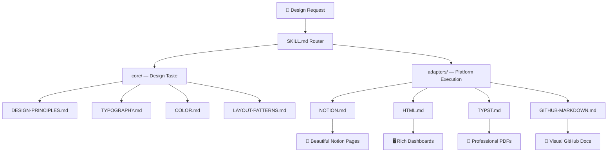

# 🎨 Design System

> An AgentSkill that gives AI agents visual design taste.

[](#)
[](#license)
[](#architecture)

## The Problem

AI agents create content that *works* but doesn't *look good*. They know the API but not the art. This skill bridges that gap — giving agents design principles, color theory, typography rules, and platform-specific knowledge to create visually beautiful output.

## Architecture



**Core** = universal design rules (always loaded)  
**Adapter** = platform-specific execution (one per task)  
**Tokens** = semantic design values (colors, spacing, sizing)

## Install

Copy the `design-system/` folder to your skills directory:

```bash
# OpenClaw
cp -r design-system/ ~/.openclaw/workspace/skills/

# Claude Code
cp -r design-system/ ~/.claude/skills/
```

## How It Works

1. Agent receives a design-related request
2. `SKILL.md` routes to the right adapter based on target platform
3. Relevant `core/` files are loaded for design principles
4. The adapter provides platform-specific patterns and recipes
5. `tokens/` provides consistent design values when building from scratch

## Supported Platforms

| Platform | Adapter | Capabilities |
|----------|---------|-------------|
| **Notion** | `NOTION.md` | 30+ block types, covers, icons, columns, callouts, synced blocks, embeds, colors, templates |
| **HTML/CSS** | `HTML.md` | Modern CSS (container queries, nesting, :has()), dashboards, charts, dark mode, responsive |
| **Typst** | `TYPST.md` | Professional PDFs, tables, diagrams, title pages, Typst Universe packages, Pandoc integration |
| **GitHub** | `GITHUB-MARKDOWN.md` | Alerts, Mermaid diagrams, math, badges, HTML elements, collapsible sections |

## Contributing

1. Fork the repo
2. Add or improve an adapter
3. Keep files concise — every line must earn its tokens
4. Submit a PR

## License

MIT
