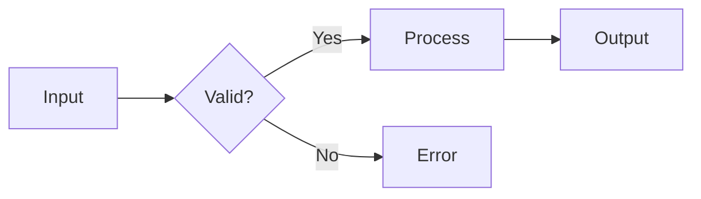
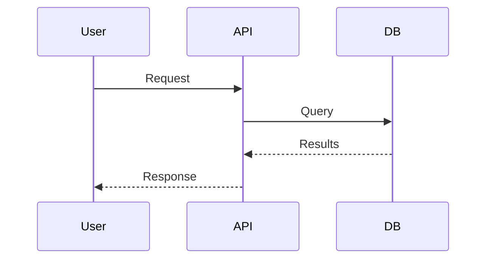
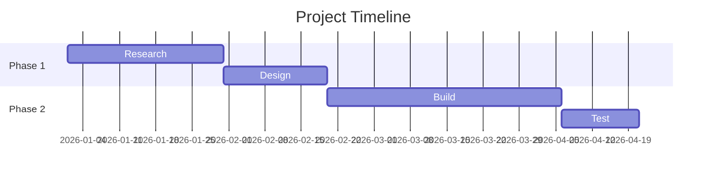
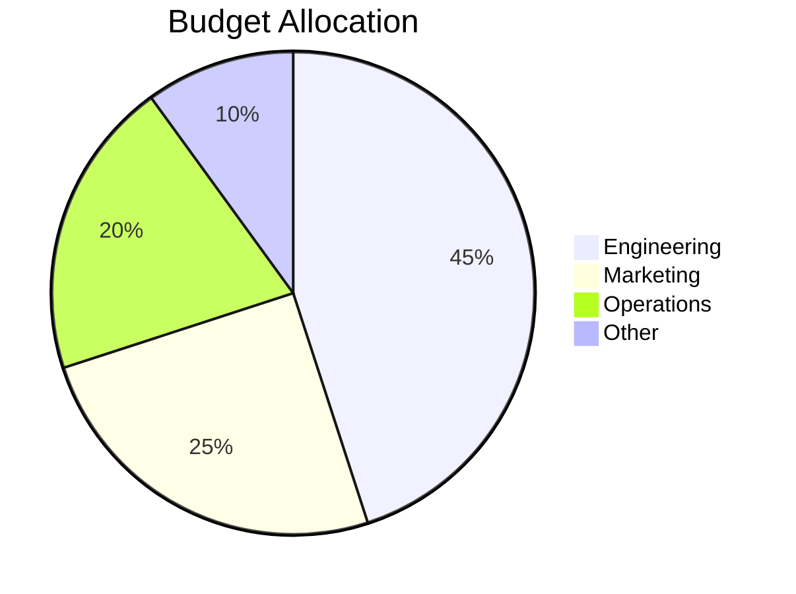

# GitHub Markdown Adapter

Maximize GitHub Flavored Markdown for visually rich READMEs, docs, and issues.

## Alerts (Admonitions)

Five built-in alert types with automatic styling:

```markdown
> [!NOTE]
> Useful information that users should know.

> [!TIP]
> Helpful advice for doing things better or more easily.

> [!IMPORTANT]
> Key information users need to know to achieve their goal.

> [!WARNING]
> Urgent info that needs immediate user attention to avoid problems.

> [!CAUTION]
> Advises about risks or negative outcomes of certain actions.
```

| Alert | Color | Use for |
|-------|-------|---------|
| NOTE | Blue | Context, background info |
| TIP | Green | Best practices, shortcuts |
| IMPORTANT | Purple | Must-know information |
| WARNING | Yellow | Pitfalls, common mistakes |
| CAUTION | Red | Destructive actions, breaking changes |

## Mermaid Diagrams

Rendered natively by GitHub. Wrap in ` ```mermaid ` code blocks.

### Flowchart
````markdown

````

### Sequence Diagram
````markdown

````

### Gantt Chart
````markdown

````

### Pie Chart
````markdown

````

## Math (KaTeX)

```markdown
Inline: $E = mc^2$

Block:
$$
\sum_{i=1}^{n} x_i = x_1 + x_2 + \cdots + x_n
$$
```

## Tables

```markdown
| Feature | Status | Priority |
|:--------|:------:|----------:|
| Auth    | ✅ Done | High     |
| API     | 🔄 WIP | High     |
| Docs    | ❌ TODO | Medium   |
```

- `:---` left, `:---:` center, `---:` right
- Use emoji for visual status (✅ ❌ 🔄 ⚠️ 🟢 🟡 🔴)

## Badges (shields.io)

```markdown


```

**Dynamic badges:**
```markdown


```

Group badges on one line for a clean header:
```markdown
[](#) [](#) [](#)
```

## HTML Elements (Allowed in GitHub Markdown)

### Collapsible Sections
```html
<details>
<summary><strong>Click to expand</strong></summary>

Content here (leave blank line after summary tag).

- Supports full Markdown inside
- Including code blocks

</details>
```

### Keyboard Shortcuts
```html
Press <kbd>Ctrl</kbd> + <kbd>Shift</kbd> + <kbd>P</kbd> to open.
```

### Superscript / Subscript
```html
H<sub>2</sub>O is water. E = mc<sup>2</sup>.
```

### Image Sizing
```html

```

### Centered Content
```html
<div align="center">
  
  <h3>Project Name</h3>
  <p>Short description of the project.</p>
</div>
```

### Picture (Light/Dark Mode)
```html
<picture>
  <source media="(prefers-color-scheme: dark)" srcset="logo-dark.png">
  <source media="(prefers-color-scheme: light)" srcset="logo-light.png">
  
</picture>
```

## Task Lists
```markdown
- [x] Completed task
- [ ] Pending task
- [ ] Another task
```

## Footnotes
```markdown
This needs clarification[^1].

[^1]: Here's the detailed explanation.
```

## README Structure Pattern

```markdown
<div align="center">
  
  <h1>Project Name</h1>
  <p>One-line description</p>

  [](#) [](#) [](#)
</div>

---

## ✨ Features

- **Feature 1** — Short description
- **Feature 2** — Short description

## 🚀 Quick Start

\`\`\`bash
npm install package
\`\`\`

## 📖 Documentation

> [!TIP]
> Start with the [Getting Started guide](link).

## 🗺️ Architecture

\`\`\`mermaid
flowchart LR
  A --> B --> C
\`\`\`

<details>
<summary>📋 Full API Reference</summary>
...detailed content...
</details>

## 📄 License

MIT
```
